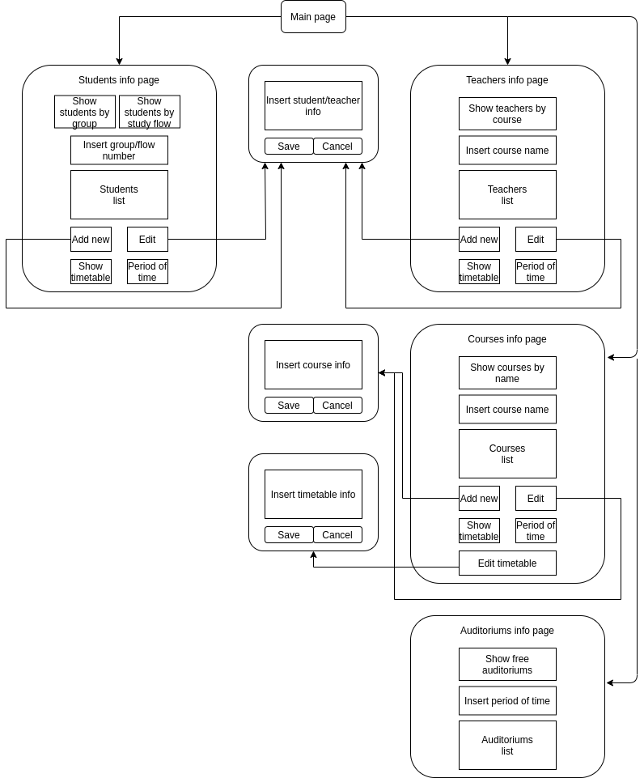

# Учебное расписание
## Схема базы данных

## Описание страниц

Основные страницы (большие сущности на схеме) содержат информацию о студентах, преподавателях, курсах и аудиториях. 
Страницы, содержащие информацию о студентах и преподавателях, схожи по структуре. На них предусмотрена возможность вывести список лиц, обладающих определенными признаками (группа и поток для студентов, учебный курс для преподавателей), отобразить расписание конкрентого студента/преподавателя на заданный интервал времени, отредактировать информацию о выбранном студенте/преподавателе или добавить новую посредством перехода на вспомогательные страницы (малые сущности на схеме).
На странице, содержащей информацию о проводимых курсах, помимо прочего, предусмотрена возможность перейти на вспомогательную страницу для редактирования расписания занятий.

**Students info page**: каждая строка в списке студентов содержит ФИО студента, номер группы, номер потока, курсы, которые он посещал и дату их прохождения. На данной странице можно отобразить студентов по конкретным номерам групп или потоков, выбрать определенного студента и, перейдя на вспомогательную страницу редактирования, изменить информацию о нем. Также предусмотрена возможность отобразить расписание выбранного в списке студента на заданный интервал времени.

**Teachers info page**: каждая строка в списке преподавателей содержит ФИО преподавателя и преподаваемые курсы. На данной странице можно выбрать кокретного преподавателя и, перейдя на вспомогательную страницу редактирования, изменить информацию о нем. Также предусмотрена возможность отобразить расписание выбранного в списке преподавателя на заданный интервал времени.

**Courses info page**: каждая строка в списке курсов содержит название курса и охват, то есть номера групп/потоков или указание о том, что это спецкурс и список проходящих данный курс студентов с ФИО и идентификатором, также ФИО преподавателя и его идентификатор и кол-во пар в неделю. Можно выбрать конкретный курс и внести в поля списка изменения, задать расписание для курса, перейдя на вспомогательную страницу.

**Auditoriums info page**: каждая строка в списке аудиторий содержит номер аудитории и количество мест. На странице будет предусмотрена возможность отобразить свободные аудитории на заданный интервал времени.

**Страница редактирования/ввода нового студента/преподавателя**: данная страница предоставляет возможность изменить существующие поля списка студентов/преподавателей или ввести данные нового студента/преподавателя. 

**Страница редактирования/ввода нового курса**: данная страница предоставляет возможность изменить существующие поля списка курсов или ввести данные нового студента/преподавателя.

**Страница редактирования расписания курса**: данная страница предоставляет возможность скорректировать расписание существующего курса или составить его для курса, добавленного ранее на **странице ввода нового курса**.

## Сценарии использования

### 1. Студенты:

  **1) Получение списков студентов по номерам групп**

`Students info page -> ввод номеров групп в поле "Insert group/flow number" -> кнопка "Show students by group"`

  **2) Получение списков студентов по номерам потоков**

Students info page -> ввод номером потоков в поле "Insert group/flow number" -> кнопка "Show students by study flow"

**3) Редактирование данных о студенте/удаление студента**

Students info page -> выбор конкретного студента в списке "Students list" -> кнопка "Edit" -> переход на **страницу редактирования/ввода нового студента/преподавателя** -> изменение полей списка для конкретного студента/удаление идентификатора студента

**4) Добавление студента**

Students info page -> кнопка "Add new" -> переход на **страницу редактирования/ввода нового студента/преподавателя** -> ввод полей списка для нового студента

**5) Получение расписания на заданный интервал времени для студента**

Students info page -> выбор конкретного студента в списке "Students list" -> ввод дат в поле "Period of time" -> кнопка "Show timetable"

### 2. Преподаватели:

**1) Получение списков преподавателей (по проводимым курсам)**

Teachers info page -> ввод идентификатора/названия курса в поле "Insert course name" -> кнопка "Show teachers by course"

(Список всех преподавателей будет отображаться на странице "**Teachers info page**" по умолчанию)

**2) Редактирование данных о преподавателе/удаление преподавателя**

Teachers info page -> выбор конкретного преподавателя в списке "Teachers list" -> кнопка "Edit" -> переход на **страницу редактирования/ввода нового студента/преподавателя** -> изменение полей списка для конкретного преподавателя/удаление идентификатора преподавателя

**3) Добавление преподавателя**

Teachers info page -> кнопка "Add new" -> переход на **страницу редактирования/ввода нового студента/преподавателя** -> ввод полей списка для нового преподавателя

**4) Получение расписания на заданный интервал времени для преподавателя**

Teachers info page -> выбор конкретного преподавателя в списке "Teachers list" -> ввод дат в поле "Period of time" -> кнопка "Show timetable"

### 3. Курсы:

**1) Редактирование данных о курсе/удаление курса**

Courses info page -> выбор конкретного курса в списке "Сourses list" -> кнопка "Edit" -> переход на **страницу редактирования курса** -> изменение полей списка для конкретного курса/удаление идентификатора курса

(В поле, соответствующее студентам курса, можно ввести номера групп или ввести студентов индивидуально)

**2) Добавление курса**

Courses info page -> кнопка "Add new" -> переход на **страницу редактирования курса** -> ввод полей списка для нового курса

(В поле, соответствующее студентам курса, можно ввести номера групп или ввести студентов индивидуально) 

**3) Редактирование расписания для курса**

Courses info page -> выбор конкретного курса в списке "Сourses list" -> кнопка "Edit timetable" -> переход на **страницу редактирования расписания курса** -> изменение расписания для конкретного курса

### 4. Аудитории:

**1) Получение списка свободных аудиторий на заданный интервал времени**

Auditoriums info page -> ввод даты и времени в поле "Insert period of time" -> кнопка "Show free auditoriums"

