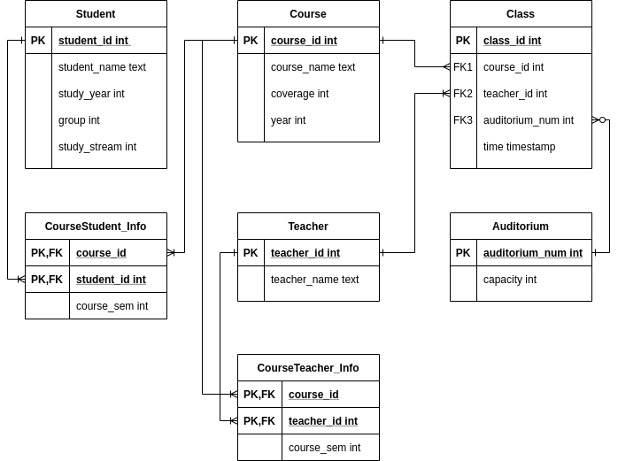

# Учебное расписание
## Схема базы данных

## Описание страниц
 содержат информацию о студентах, преподавателях, курсах и аудиториях. 
Страницы, содержащие информацию о студентах и преподавателях, схожи по структуре. На них присутствует возможность вывести список лиц, обладающих определенными признаками (группа и поток для студентов, учебный курс для преподавателей), отобразить расписание конкрентого студента/преподавателя на заданный интервал времени, отредактировать информацию о выбранном студенте/преподавателе или добавить новую посредством перехода на вспомогательные страницы (малые сущности на схеме).
На странице, содержащей информацию о проводимых курсах, помимо прочего, присутствует возможность перейти на вспомогательную страницу для редактирования расписания занятий.")
