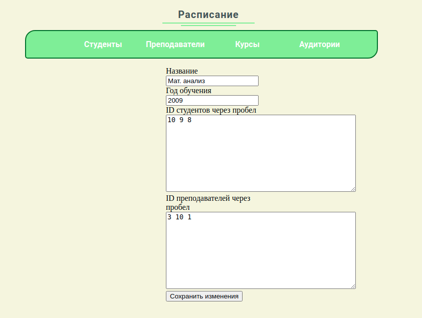

# Учебное расписание
## Главная страница (список студентов)

## Поиск по номеру группы (или потоку)

## Страница конкретного студента

## Расписание студента для заданного промежутка времени

## Страница преподавателей

Функционал страницы схож со страницей студентов, выбрав конкретного преподавателя, можно удалить его, изменить данные или показать расписание для заданного промежутка времени.

## Поиск по названию курса

## Странциа со списком курсов

## Странциа конкретного курса

## Страница изменения данных курса

## Страница составления расписания для конкретного курса

## Страница аудиторий

На этой странице присутствует возможность отобразить свободные в заданном интервале времени аудитории.

## Страница конкретной аудитории

Можно узнать расписание для аудитории в заданном интервале времени.
